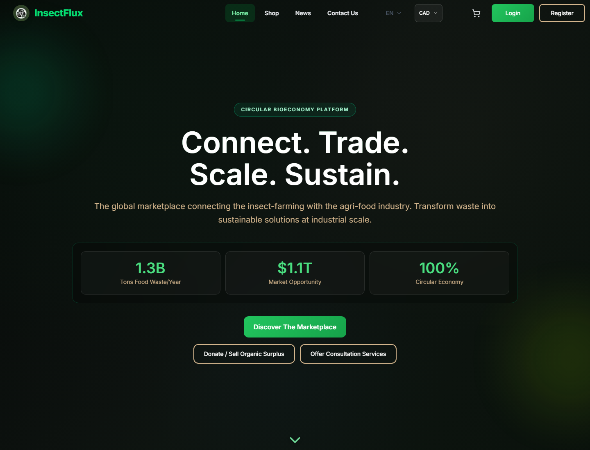
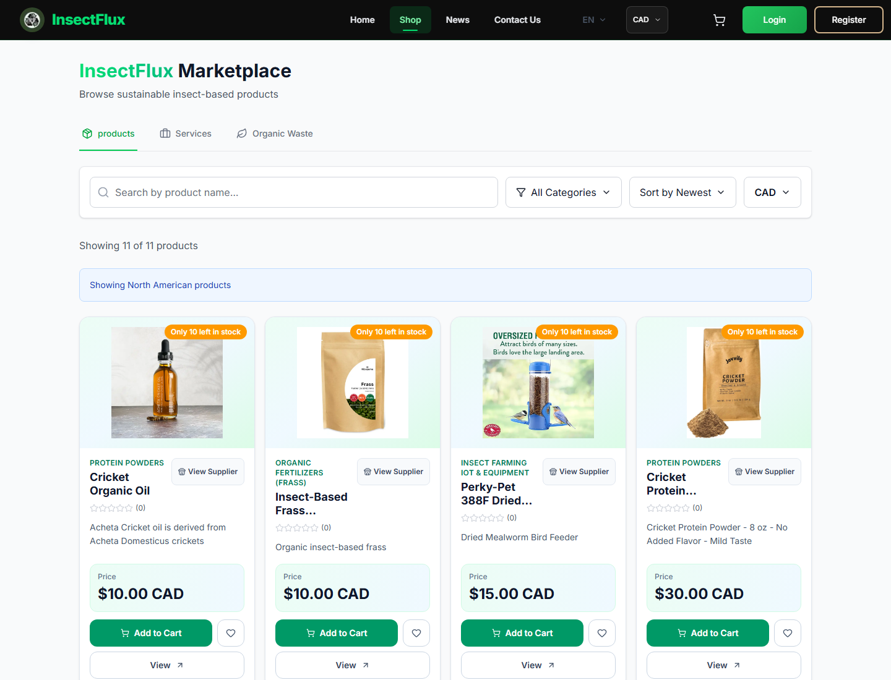
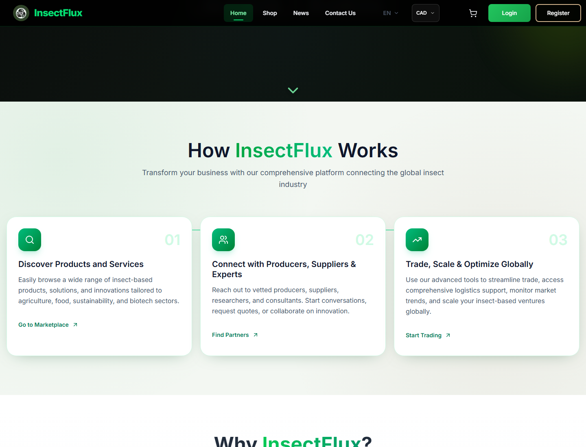

# InsectFlux — Backend Reliability Case Study



## What this is

InsectFlux is a marketplace platform for the insect-farming and agri-food ecosystem. It connects suppliers and customers through marketplace workflows such as product/service discovery, checkout, messaging, reviews, payments, and supplier/customer interactions.

I was one of three engineers on the project. This case study focuses only on the areas I can honestly represent as my core contributions:

- database migrations with forward/backward compatibility,
- backend test infrastructure,
- webhook-driven messaging and payment reliability,
- backend hardening around production-critical marketplace flows.

The source code is private/team-owned, so this repository is a public-safe engineering case study rather than a code dump.

## My role

**Role:** Backend / reliability-focused engineer  
**Team:** 3 engineers  
**Primary focus:** migrations, tests, webhooks, messaging reliability, backend hardening  
**Stack involved:** Python, FastAPI, Firebase/Firestore, Stripe, Docker, TypeScript/React, Cloudinary, Redis-style locking/cache patterns

I did not build the entire marketplace alone. My contribution was concentrated around making the backend safer to evolve, easier to test, and more reliable around the flows that could break user trust: data migrations, checkout/order behavior, messaging, webhooks, and payment-related state.

## Why this project is technically meaningful

A marketplace is not just CRUD. InsectFlux had the kinds of problems that force more mature backend engineering:

- data models changed while existing records still had to work,
- payment/webhook events could retry or arrive more than once,
- inventory and checkout flows needed regression protection,
- supplier/customer state had to remain isolated and consistent,
- messaging state needed read/sent/delivered/failed behavior,
- tests mattered most around money, orders, inventory, and user trust.

This project pushed me from "building features" toward thinking like a backend systems engineer.

## Engineering highlights

### 1. Migration-safe backend evolution

The marketplace data model evolved over time. The hard part was not simply changing fields; it was preserving behavior while old and new records coexisted.

I worked on migration and compatibility paths so schema changes could be introduced without brittle one-shot breakage.

Key themes:

- forward/backward compatibility,
- old/new record handling,
- service migration logic,
- reducing risk during schema evolution,
- protecting marketplace workflows during data changes.

> Engineering lesson: changing a schema is easy; changing it without breaking older records, frontend assumptions, payment flows, or order behavior is the real work.

### 2. Test infrastructure around high-risk flows

I built out tests around the parts of the system most likely to cause real damage if broken.

Coverage areas included:

- checkout inventory validation,
- insufficient stock and out-of-stock cases,
- multi-supplier order splitting,
- supplier dashboard isolation,
- review flow consistency,
- Stripe/webhook behavior,
- auth API behavior,
- currency conversion and supplier payout currency,
- cart and product frontend behavior.

Representative private test areas included backend tests for cart inventory, multi-supplier orders, reviews, webhook race conditions, auth APIs, currency conversion, product services, and Stripe checkout behavior.

### 3. Webhook and messaging reliability

Marketplace systems can fail in subtle ways when payment events, webhook retries, inventory updates, and messaging flows interact.

I worked on reliability patterns around webhook and messaging flows, including:

- webhook event deduplication,
- payment session idempotency,
- distributed lock / race-condition prevention patterns,
- webhook monitoring endpoints,
- supplier/customer messaging support,
- message sent/read/delivered/failed states,
- unread counts and conversation APIs.

This work was about preventing duplicate processing, incorrect payment/order state, and race-condition bugs.

### 4. Backend hardening for production-readiness

Beyond individual features, I worked on making critical backend flows safer to maintain and evolve.

Hardening themes:

- auth and validation paths,
- checkout/order reliability,
- supplier/customer isolation,
- payment/session handling,
- testable service logic,
- Docker/deployment-readiness,
- logging/monitoring-oriented design.

## Architecture snapshot

```text
Frontend Marketplace UI
  |-- product/service browsing
  |-- cart and checkout
  |-- supplier/customer messaging
  |-- reviews
  v
FastAPI Backend
  |-- auth/user APIs
  |-- product/service APIs
  |-- order/checkout APIs
  |-- messaging APIs + websocket support
  |-- webhook monitoring APIs
  v
Services Layer
  |-- payment/webhook idempotency
  |-- notification service
  |-- inventory/order logic
  |-- migration/compatibility handling
  v
Data + External Services
  |-- Firebase/Firestore
  |-- Stripe
  |-- Cloudinary/media
  |-- Redis/locking/cache where configured
```

See [ARCHITECTURE.md](ARCHITECTURE.md) for a short public-safe architecture note.

## Screenshots

### Marketplace landing page


### Marketplace products view



### Product narrative / workflow section



## Interview-ready summary

> I was one of three engineers on InsectFlux, a marketplace platform for the insect-farming/agri-food ecosystem. My strongest ownership areas were database migrations with forward/backward compatibility, the testing suite, webhook-driven messaging/payment reliability, and backend hardening. The most technical work involved making evolving marketplace data models safe, testing high-risk checkout/order/supplier flows, and preventing duplicate webhook/race-condition failures.

## What this demonstrates

This project demonstrates that I can work beyond tutorial-level software and handle backend problems that show up in real products:

- schema evolution,
- compatibility strategy,
- reliability testing,
- payment/webhook safety,
- marketplace domain complexity,
- production-readiness thinking,
- honest collaboration in a multi-engineer project.

## Privacy note

The production repository and business data are private/team-owned. This public case study intentionally avoids exposing source code, secrets, customer/supplier data, internal deployment details, or teammate-owned implementation details.
